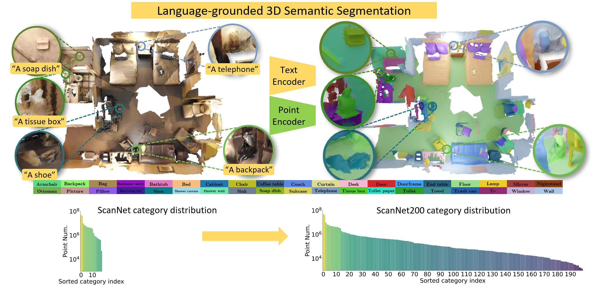

## Language-Grounded Indoor 3D Semantic Segmentation in the Wild 
### Implementation for our ECCV 2022 paper

<div align="center">
    
</div>

**Abstract -** 
Recent advances in 3D semantic segmentation with deep neural networks have shown remarkable success, with rapid performance increase on available datasets.
However, current 3D semantic segmentation benchmarks contain only a small number of categories -- less than 30 for ScanNet and SemanticKITTI, for instance, which are not enough to reflect the diversity of real environments (e.g., semantic image understanding covers hundreds to thousands of classes).

Thus, we propose to study a larger vocabulary for 3D semantic segmentation with a new extended benchmark on ScanNet data with 200 class categories, an order of magnitude more than previously studied.
This large number of class categories also induces a large natural class imbalance, both of which are challenging for existing 3D semantic segmentation methods.
To learn more robust 3D features in this context, we propose a language-driven pre-training method to encourage learned 3D features that might have limited training examples to lie close to their pre-trained text embeddings.
Extensive experiments show that our approach consistently outperforms state-of-the-art 3D pre-training for 3D semantic segmentation on our proposed benchmark (+9% relative mIoU), including limited-data scenarios with +25% relative mIoU using only 5% annotations. 

[arXiv](https://arxiv.org/abs/2204.07761) | [Project Page](https://rozdavid.github.io/scannet200) | [Benchmark](http://kaldir.vc.in.tum.de/scannet_benchmark/) |  [Video](https://www.youtube.com/watch?v=Cu-zW1oXrvU)

**Main Contributions:**
  - We propose a new 200-class 3D semantic segmentation benchmark on real-world 3D ScanNet scene data, considering an order of magnitude more category annotation labels than existing 3D semantic segmentation benchmarks.
  - To guide the construction of robust 3D semantic feature representations for this challenging task, we propose to align geometric feature extraction to the category embedding of the CLIP pretrained language model. This results in improved performance both overall and in the rarely seen, including in the limited-data regime.

For any code-related or other questions open an issue [here](https://github.com/RozDavid/LanguageGroundedSemseg/issues) or contact [David Rozenberszki](https://rozdavid.github.io) 

If you found this work helpful for your research, please cite our paper:

```text
@inproceedings{rozenberszki2022language,
    title={Language-Grounded Indoor 3D Semantic Segmentation in the Wild},
    author={Rozenberszki, David and Litany, Or and Dai, Angela},
    booktitle = {Proceedings of the European Conference on Computer Vision ({ECCV})},
    year={2022}
}
```  

### Installation
The codebase was developed and tested on Ubuntu 20.04, with various GPU versions *[RTX_2080, RTX_3060, RXT_3090, RXT_A6000]* and NVCC 11.x

We provide an Anaconda environment with the dependencies, to install run 

```sh
conda env create -f config/lg_semseg.yml
conda activate lg_semseg
```

Additionally, [MinkowskiEngine](https://github.com/NVIDIA/MinkowskiEngine) has to be installed manually with a specified CUDA version. 
E.g. for CUDA 11.1 run 

```sh
export CUDA_HOME=/usr/local/cuda-11.1
pip install -U git+https://github.com/NVIDIA/MinkowskiEngine -v --no-deps --install-option="--blas=openblas"
```
Note: We use 0.5.x versions, where the pretrained weights are not compatible with models trained with 0.4.x ME releases.

## Dataset

In this project we are focusing on a much more realistic scenario of 3D indoor semantic segmentation, with a much larger set of categories. 
For this, we proposed the ScanNet200 Benchmark as a modification of the original ScanNet dataset, but with an order of magnitude more categories. 

For downloading the raw data, please refer to the instructions on the official [GitHub page](https://github.com/ScanNet/ScanNet). 
If ScanNet was previously downloaded for an earlier project, the only thing that needs to be updated is the label mapping file ```scannetv2-labels.combined.tsv``` .
Benchmark submissions can be made at the [benchmark page](http://kaldir.vc.in.tum.de/scannet_benchmark/), while helper scripts can be found [here](https://github.com/ScanNet/ScanNet/tree/master/BenchmarkScripts/ScanNet200). 

To preprocess the raw data for this project for semantic segmentation (both fully annotated and limited annotation scenario), modify the path values in the first few lines of the script and run:

```sh
cd lib/datasets/preprocessing
python scannet_long.py
```
And for instance segmentation

```sh
cd lib/datasets/preprocessing
python scannet200_insseg.py --input <SCANNET_PATH>
```

After the ScanNet200 dataset is preprocessed we provide [extracted data files](https://kaldir.vc.in.tum.de/rozenberszki/language_grounded_semseg/feature_data.zip) that we preprocessed for our method.
The Zip file with all the necessary content can be downloaded from here and should be placed in the same folder where the processed data files live.
Please refer to our paper on how these files were created and what they are used for.
So the preprocessed dataset should look something like this: 

```
    feature_data/
        |--clip_feats_scannet_200.pkl
        |--dataset_frequencies.pkl
        |--scannet200_category_weights.pkl
        |-- ...
    train/
       |--scene0000_00.ply
       |--scene0000_01.ply
       |--...
    train.txt
    val.txt
```


## Language Grounded Pretraining

The goal of this stage is to anchor the representation space to the much more structured
language-based CLIP space. For this, we first preprocess CLIP text encodings of ScanNet200 categories to save computation, 
then pretrain our models with our Contrastive loss formulation detailed in our paper.

For this stage, again modify environment variables 
``DATA_ROOT`` and``OUTPUT_DIR_ROOT``, then run

```sh
conda activate lg_semseg
source scripts/text_representation_train.sh <BATCH_SIZE> <TRAIN_NAME_POSTFIX> <ADDITIONAL_ARGS>
```

Refer to our [config](config/config.py) file for additional training and validation parameters. 

We also provide pretrained model checkpoints for different model sizes and the precomputed CLIP features for anchoring the pretraining stage.

## Downstream Semantic Segmentation

For this stage again modify environment variables 
``DATA_ROOT``, ``PRETRAINED_WEIGHTS`` and``OUTPUT_DIR_ROOT``, then run

```sh
conda activate lg_semseg
source scripts/train_models.sh <MODEL> <BATCH_SIZE> <TRAIN_NAME_POSTFIX> <ADDITIONAL_ARGS> <WEIGHTS_PATH>
```

## Downstream Instance Segmentation

For instance segmentation, we largely rely on the implementation of [Contrastive Scene Contexts](https://github.com/facebookresearch/ContrastiveSceneContexts/tree/main/downstream/insseg).
The clustering algorithm is based on the PointGroup algorithm, so we have to build that first
```shell
cd downstream/insseg/lib/bfs/ops
python setup.py build_ext --include-dirs=<YOUR_ENV_PATH>/include
python setup.py install
```

```shell
cd downstream/insseg
. scripts/train_scannet_slurm.sh <BATCH_SIZE> <MODEL> <TRAINING_POSTFIX> <PRETRAINED_CHECKPOINT>
```

## Model Zoo

We provide trained models from our method and at different stages. Pretrain stage means where we only anchored model representations to the CLIP text encodings, while finetuned models can be directly evaluated on ScanNet200. 

| Model Architecture | Pretrain Strategy |  Stage   |                                                       Link                                                       |
|:-------------------|:-----------------:|:--------:|:----------------------------------------------------------------------------------------------------------------:|
| Res16UNet34D       |       Ours        | Pretrain |            [download](https://kaldir.vc.in.tum.de/rozenberszki/language_grounded_semseg/Weights/34D/34D_CLIP_pretrain.ckpt)            |
| Res16UNet34D       |       Ours        | Finetune |            [download](https://kaldir.vc.in.tum.de/rozenberszki/language_grounded_semseg/Weights/34D/34D_CLIP_finetune.ckpt)            |
| Res16UNet34C       |       Ours        | Pretrain | [download](https://kaldir.vc.in.tum.de/rozenberszki/language_grounded_semseg/Weights/34C/34C_CLIP_pretrain.ckpt) |
| Res16UNet34C       |       Ours        | Finetune | [download](https://kaldir.vc.in.tum.de/rozenberszki/language_grounded_semseg/Weights/34C/34C_CLIP_finetune.ckpt) |


## Acknowledgment
We thank the authors of [CSC](https://github.com/facebookresearch/ContrastiveSceneContexts) and [SpatioTemporalSegmentation](https://github.com/chrischoy/SpatioTemporalSegmentation) for their valuable work and open-source implementations.
